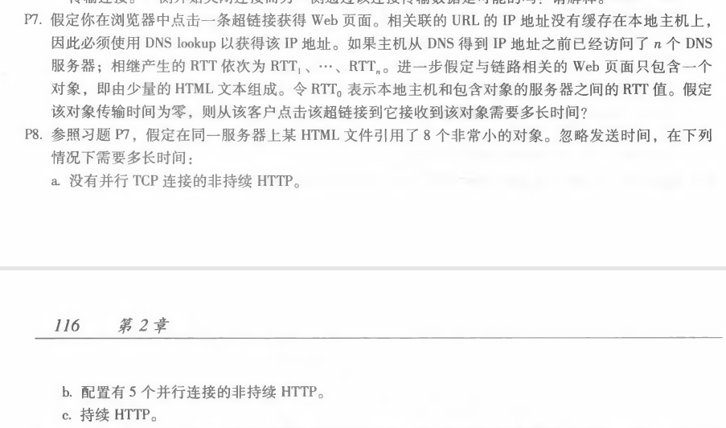

# 网络及分布式计算第四次作业

#### 2017302580018  刘佳媚

---

#### nslookup  www.whu.edu.cn

------

### 1、P8

##### 

  解：

a.
     2RTT0 + RTT1 + RTT2 + … + RTTn + 8 * 2 RTT0 = 18 RTT0 + RTT1 + RTT2 + … + RTTn

b.
     2RTT0 + RTT1 + RTT2 + … + RTTn + 2 * 2 RTT0 = 6 RTT0 + RTT1 + RTT2 + … + RTTn

c.
     2RTT0 + RTT1 + RTT2 + … + RTTn + RTT0 = 3 RTT0 + RTT1 + RTT2 + … + RTTn

   

---

### 2、P14

#####  

  解：

​        SMTP 使用仅包含一个句号的一行来标志报文体结束，HTTP 使用 Content-Length 标志。HTTP不能使用与SMTP标识一个报文体结束相同的方法，因为报文内容可能含有句号。

------

### 3、P23

  解：

a.
     因为 us/N <= dmin，所以客户端也以该速率下载。因此每个客户端接收完文件的时间为 F / (us / N) = NF / us。

b.
     因为 us/N >= dmin，所以 us >= Ndmin，所以服务器可以承受这个速率，各服务器以 dmin 为下载速率，接收时间为 F/dmin。

c.
     当 us/N <= dmin 时：
               NF/us >= F/dmin
               t = NF/us = max{NF/us, F/dmin}

​        当 us/N >= dmin 时：
​               NF/us <= F/dmin
​               t = F/dmin = max{NF/us, F/dmin}

​        因此：得出最小分发时间为 max{NF/us，F/dmin}
