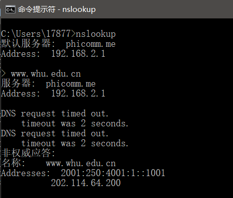

# 作业四
### 2017302580213 彭英杰 软工五班
-----------

> ## NSLOOKUP
>
> ​		NSLOOKUP是NT、2000中连接DNS服务器，查询域名信息的一个非常有用的命令，可以指定查询的类型，可以查到DNS记录的生存时间还可以指定使用哪个DNS服务器进行解释。在已安装TCP/IP协议的电脑上面均可以使用这个命令。主要用来诊断域名系统 (DNS) 基础结构的信息。
>
> ## **nslookup  www.whu.edu.cn**
>
> - 进入命令行，输入nslookup，连接到当前正在上网的dns服务器，该网络环境下为phicomm.me。
>
> - 在>后输入要查询的域名，本例中使用www.whu.edu.cn。
>
> - 得到图示结果
>   
>
> 图示结果解析:
>
> 1. 非权威回答：假设DNS服务器中没有存储域名test.com的相关信息，则当客户端请求获得域名test.com的相关信息时DNS服务器就会通过迭代递归的方式从test公司的DNS服务器中获取test.com的域名信息返回给客户端，同时会把test.com的相关信息存储在自己缓冲中一段时间，当下次客户端再次请求test.com信息时就从自身缓冲中提取信息返回给客户端，这个回答叫“非权威回答”。
> 2. Addresses有很多记录，说明whu.edu.cn域名实际对呀多个物理主机，当用户访问www.whu.edu.cn时按照一定的规则由其中一台计算机进行应答。
> 
---------------

> ## P5
>
> a.服务器能够成功定位文档，根据状态码 200 OK 可知。
> 该文档提供回答在Tue，07 Mar 2008 12 12:39:45GMT。由Data：首部行给出
>
> b.最后一次修改 文档的时间是Sat, 10 Dec 2005 18:27:46 GMT。由Last-Modified：首部行给出
> 
>c.该文档被返回的字节是 3874 字节。由Content-Length: 3874可知
> 
>d.文档被返回的前五个字节为:<!doc。
>服务器同意持久连接，由Connection：Keep-Alive可知
> 
----------------

> ## P10
>
> 无意义，采用非持续并行连接时，打开10个并行连接，每个连接需要建立一个TCP连接来接收一个引用对象，初始下载对象包含10个引用对象，但是这些并行连接链路带宽只有原来的十分之一，总下载速度与串行连接时一致，建立TCP连接的速度也等于串行连接建立10次TCP连接的速度。
> 期待，持续HTTP连接时只需建立一次TCP连接，且占据所有的链路带宽，下载时间一样，但花费在建立TCP连接的时间为原来的十分之一。

----------------

> ## P11
>
> a.能，Bob使用非持续 HTTP 并行连接，总连接数中占据更多连接，可以得到其他用户的几倍链路带宽
>
> b.是的，Bob使用并行下载相对而言依然有好处，不使用并行连接，他将得到比其他用户更少的带宽。

----------------

