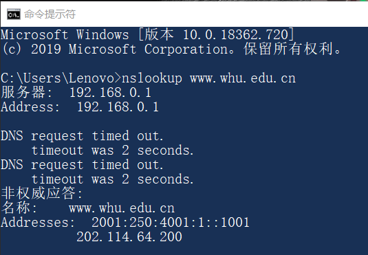
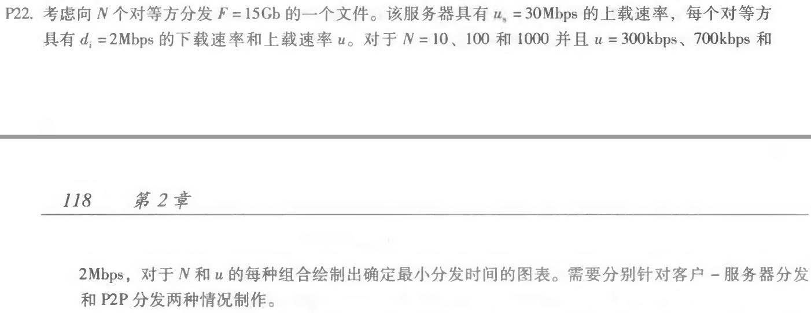

## Homework_4

**Author：**

姓名： 王泽生

学号：2017302580268

第二章习题：**P22、P23、P24**

**注**：**公式查看**请安装 Chrome浏览器插件：**MathJax Plugin for Github** 

### 1 nslookup www.whu.edu.cn

nsloookup用于查询DNS的记录，查看域名解析是否正常，在网络故障的时候用来诊断网络问题。

如下图：打开 Windows 命令行，键入 `nslookup www.whu.edu.cn`

截图：

结果分析：

* 首先出现默认本机 DNS 服务器名和 IP 地址
* 从非权威应答可以看出 `www.whu.edu.cn` 的 IPv6 地址与 IPv4 地址

### 2 课本第二章习题

#### P22

**解答：**

1. 客户 - 服务器分发

   分发时间公式：
   $$
   D_{cs}=max\lbrace\frac{FN}{u_s},\frac{F}{d_{min}}\rbrace
   $$

   | u\N     | 10   | 100   | 1000   |
   | ------- | ---- | ----- | ------ |
   | 300kbps | 7680 | 51200 | 512000 |
   | 700kbps | 7680 | 51200 | 512000 |
   | 2Mbps   | 7680 | 51200 | 512000 |

2. P2P 分发

   分发时间公式：
$$
   D_{P2P}=max\{
   \frac{F}{u_s},\frac{F}{d_{min}},\frac{NF}{u_s+\displaystyle\sum_{i=1}^nu_i}
   \}
$$

| u\N     | 10   | 100   | 1000  |
| ------- | ---- | ----- | ----- |
| 300kbps | 7680 | 25904 | 47559 |
| 700kbps | 7680 | 15616 | 21525 |
| 2Mbps   | 7680 | 7680  | 7680  |

#### P23

**解答：**

采用 P2P 结构体系分发，则有实际最小分发时间：
$$
D_{cs}=max\lbrace\frac{FN}{u_s},\frac{F}{d_{min}}\rbrace
$$
**a:**

**方案**： 其中服务器以 $u_s/N$ 的速率并行地向每个客户端发送文件 

**解释**： 

此速率低于客户端的每个下载速率，因为假设我们 $u_s/N<= d_{min}$。

因此，每个客户端也可以以  $u_s/N$ 的速率接收，因为每个客户端以  $u_s/N$ 的速率接收，每个客户端接收整个文件的时间是 $F/(u_s/N)=NF/u_s$。由于所有客户端都在 $NF/u_s$ 内接收文件，所以总的分发时间也是 $NF/u_s$ 。 

**b：**

**方案**： 服务器并行地向每个客户端发送文件，速率为 $d_{min}$。 

**解释**： 

聚合速率 $N*d_{min}$ 小于服务器的限制速率，因为假设我们 $u_s/N>= d_{min}$。由于每个客户端以 $ d_{min}$ 的速率接收，每个客户端接收整个文件的时间是 $F/d_{min}$。因为所有客户端都在这段时间内接收文件，所以整个分发时间也是 $F/d_{min}$。 

**c：**

当 $u_s/N <= d_{min}$ 时，$D_{cs}=NF/u_s$

当 $u_s/N >= d_{min}$时，$D_{cs}=F/d_{min}$

故有：$D_{cs}=max\lbrace\frac{FN}{u_s},\frac{F}{d_{min}}\rbrace$

#### P24

**解答：**

定义 $u=\displaystyle\sum_{i=1}^n{u_i}$

采用 P2P 结构体系分发，则有实际最小分发时间：
$$
D_{P2P}=max\{\frac{F}{u_s},\frac{F}{d_{min}},\frac{NF}{u_s+\displaystyle\sum_{i=1}^nu_i}\}
$$

**a：**

**方案：**

将文件划分为 $N$ 个部分，第 $i$ 个部分的大小为 $(u_i/u)F$ 。

服务器以速率 $r_i=(u_i/u)u_s$ 点对点传送第 $i$ 部分给对等点 $i$。服务器上载速率总和不超过服务器最大上载速率。且每一个对等点 $i$ 将其接收到的比特以速率 转发给其余 $N-i$ 个对等点。

**解释：**

对等点 $i$ 的上载速率为 $(N-1)r_i$

我们有：$(N-1)r_i=(N-1)(u_su_i)/u <= u_i$

故对等点 $i$ 的上载速率符合范围要求

对等点 $i$ 接受速率为：$r_i+\displaystyle\sum_{j<>i}r_j=u_s$

所以每个对等点在 $F/u_s$ 内接收到文件

**b：**

**方案：**

将文件分为 $N+1$ 部分，服务器以速率 $r_i$ 将第 $i$ 部分 发送给第 $i$ 个对等点

每一个对等点 $i$ 将其接收到的比特以速率 $r_i $ 转发给其余 $N-i$ 个对等点。

服务器以速率 $r_{N+1}$ 发送第 $N+1$ 部分给 $N$ 个对等点中的每一个对等点，对等点不转发这一部分文件

**解释：**

令：$r_i=u_i/(N-1)$，$r_{N+1}=(u_s-u/(N-1))/N$

服务器总上载速率为：$\displaystyle\sum_{i=1}^n{r_i}+N(r_{N+1})=u/(N-1)+u_s-u/(N-1)=u_s$

对等点 $i$ 上载速率为：$(N-1)r_i=u_i$

对等点 $i$ 接收速率为：$r_i+r_{N+1}+\displaystyle\sum_{j<>i}r_j=(u_s+u)/N$

故每个对等点在 $NF/(u_s+u)$ 内接收到文件

**c：**

因为 $d_{min}$ 很大，所以 $F/d_{min} $ 很小，则实际最小分发时间：

$$
D_{P2P}=max\{\frac{F}{u_s},\frac{NF}{u_s+\displaystyle\sum_{i=1}^nu_i}\}
$$
结合 **a**、**b** 易得，最小分发时间由上式决定

