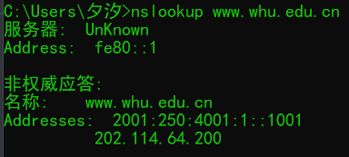

# Homework3

---

## 个人信息

- 班级：软工六班
- 学号：2017302580291
- 姓名：洪龙熙

---

## 作业

### 作业1

- 题目

> nslookup www.whu.edu.cn

- 答案

  

### 作业2

- 题目

> P23
>
> 考虑使用一种客户 - 服务器体系结构向 N 个对等方分发一个 F 比特的文件。假定一种某服务器能够同时向多个对等方传输的流体模型，只要组合速率不超过u~s~，则以不同的速率向每个对等方传输。
>
> 1. 假定 ${u_s \over N } \leq d_{min}$。定义一个具有 ${NF} \over u_s$ 分发时间的分发方案。
> 2. 假定 ${u_s \over N } \geq d_{min}$。定义一个具有 $F \over d_{min}$ 分发时间的分发方案。
> 3. 得出最小分发时间通常是由 $max\lbrace {{NF} \over u_s}, {F \over d_{min}} \rbrace$ 所决定的结论。

- 答案

  1. 若 ${u_s \over N } \leq d_{min}$， 则 $ {NF \over u_s} \geq {F \over d_{min}} $，则 $D_{CS} = {NF \over u_s}$
  
     采用客户-服务器体系结构，服务器与对等方使用接入链路与因特网相连。
  
     1. 当服务器上传第一个 F 比特的文件时，向一个随机对等方开始传输文件。
  
     2. 此后，每当上传一个 F 比特文件时，均随机向一个对等方传输文件，前提是当加入该对等方时，组合速率不超过 u~s~ 。
  
  2. 若 ${u_s \over N } \geq d_{min}$， 则 $ {NF \over u_s} \leq {F \over d_{min}} $，则 $D_{CS} = {F \over d_{min}}$
  
     采用客户-服务器体系结构，服务器与对等方使用接入链路与因特网相连。
  
     1. 当服务器上传第一个 F 比特的文件时，调度传输速度是 d~min~ 的对等方开始传输文件。
  
     2. 此后，每当上传一个 F 比特文件时，随机选取一个对等方开始传输，前提是开始该对等方传输时组合速率不超过u~s~ 。
  
  3. 若 ${u_s \over N } \leq d_{min}$， 则 $ {NF \over u_s} \geq {F \over d_{min}} $，上传所有文件耗时大于下载文件的时间，故上传完所有文件时才能完成传输；
  
     若 ${u_s \over N } \geq d_{min}$， 则 $ {NF \over u_s} \leq {F \over d_{min}} $，则具有最慢传输速度的对等方传输文件的时间应比服务器传输完所有的文件的时间还要长。等待每一个对等方均完成才算是完成，所以即使早已上传所有文件，也必须等待最慢的对等方完成传输才算是完成分发。
  
     综上，可得出，$D_{CS} = max\lbrace {{NF} \over u_s}, {F \over d_{min}} \rbrace$

### 作业3

- 题目

> P24
>
> 考虑使用 P2P 体系结构向 N 个用户分发 F 比特的一个文件。假定一种流体模型。为了简化起见，假定 $d_{min}$ 很大，因此对等方下载带宽不会成为瓶颈。 
>
> 1. 假定 $u_s \leq {{(u_s + u_1 + u_2 + \cdots + u_N)} \over N}$ 。定义一个具有 $F \over u_s$ 分发时间的分发方案。
> 2. 假定 $u_s \geq {{(u_s + u_1 + u_2 + \cdots + u_N)} \over N}$ 。定义一个具有 $NF \over {(u_s + u_1 + u_2 + \cdots + u_N)}$ 分发时间的分发方案。
> 3. 得出最小分发时间通常是由 $max\lbrace {{F} \over u_s}, {NF \over (u_s + u_1 + u_2 + \cdots + u_N)} \rbrace$ 所决定的结论。 

- 答案

1. 若 $u_s \leq {{(u_s + u_1 + u_2 + \cdots + u_N)} \over N}$， 则 ${F \over u_s} \geq {NF \over {(u_s + u_1 + u_2 + \cdots + u_N)}}$，则 $D_{P2P} = {F \over u_s}$

   采用 Peer to Peer 体系结构，服务器与对等方使用接入链路与因特网相连。

   1. 当服务器上传了一个 F 比特的文件时，向一个随机对等方开始传输文件。

   2. 此后，该对等方开始向其余对等方开始传输。其余对等方再传输完成后也进行传输。

2. 若  $u_s \geq {{(u_s + u_1 + u_2 + \cdots + u_N)} \over N}$， 则${F \over u_s} \leq {NF \over {(u_s + u_1 + u_2 + \cdots + u_N)}}$，则 $D_{P2P} = {NF \over {(u_s + u_1 + u_2 + \cdots + u_N)}}$

   采用 Peer to Peer 体系结构，服务器与对等方使用接入链路与因特网相连。

   1. 当服务器上传了一个 F 比特的文件时，向一个随机对等方开始传输文件。

   2. 此后，该对等方开始向其余对等方开始传输。其余对等方再传输完成后也进行传输。按照已知速度，即使服务器已上传完毕，对等方之间也未完成传输，需等待对等方完成，耗时则为 ${NF \over {(u_s + u_1 + u_2 + \cdots + u_N)}}$

3. 若 $u_s \leq {{(u_s + u_1 + u_2 + \cdots + u_N)} \over N}$， 则 ${F \over u_s} \geq {NF \over {(u_s + u_1 + u_2 + \cdots + u_N)}}$，上传该文件耗时大于对等方联合传输文件的时间，故至少应该上传完该文件才能完成传输；

   若  $u_s \geq {{(u_s + u_1 + u_2 + \cdots + u_N)} \over N}$， 则${F \over u_s} \leq {NF \over {(u_s + u_1 + u_2 + \cdots + u_N)}}$，则当服务器将文件上传至网络后，还需各对等方进行传输，完毕后才可宣布分布结束。

   综上，可得出，$D_{cs} = max\lbrace {{F} \over u_s}, {NF \over (u_s + u_1 + u_2 + \cdots + u_N)} \rbrace$

### 作业4

- 题目

> P25
>
> 考虑在一个有 N 个活跃对等方的覆盖网络中，每对对等方有一条活跃的 TCP 连接。此外，假定该 TCP 连接通过总共 M 台路由器。在对应的覆盖网络中，有多少节点和边？

- 答案

  覆盖网络中，有 N 个节点，$N(N-1)\over 2$ 条边

### 作业5（个人认为作业2、作业3可看作为一道题，所以决定再写一道题）

- 题目

  > P27
  >
  > 
  >
  > 考虑一个具有 N 个视频版本（具有 N 个不同的速率和质量）和N个音频版本（具有N个不同的速率和质量）的DASH系统。假设我们想允许播放者在任何时间选择 N 个视频版本和 N 个音频版本之一：
  >
  > 1. 如果我们生成音频与视频混合的文件，因此服务器在任何时间仅发送一个媒体流，该服务器将需要存储多少个文件（每个文件有一个不同的URL）? 
  > 2. 如果该服务器分别发送音频流和视频流并且与客户同步这些流，该服务器将需要存储多少个文件？ 

- 答案

  1. $N^2$ 个
  2. $2N$ 个